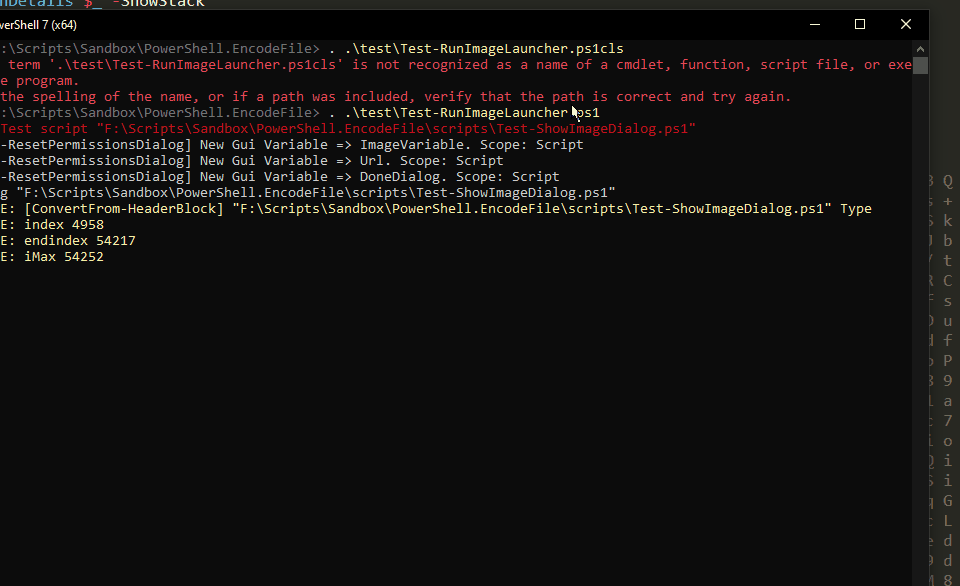
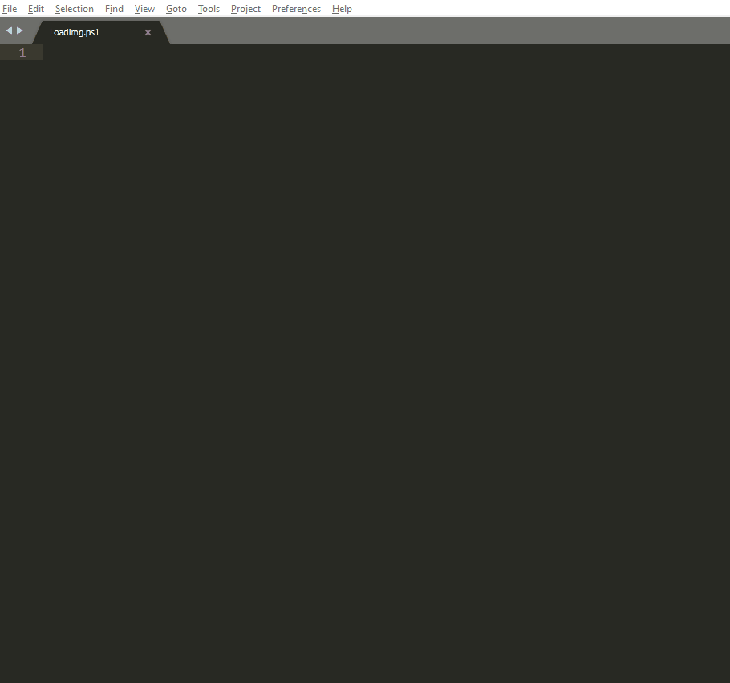

# PowerShell Proof-of-Concept Converter / File Encoder

These 2 scripts are used to encode files in other files.


## Converters - ConvertFrom-HeaderBlock / ConvertTo-HeaderBlock

These 2 functions are used to include a file (scripts, binary, etc) as a resource in another text file. The latter is represented as a text header like this:

```
  <# === BEGIN EMBEDDED FILE HEADER === 
  H 4 s I A A A A A A A A C p 1 W X U / b M B R 9 r 9 T / c F V V a q K R a H t
  F q g S U d m J j r K I V L 6 x C J r l t g l y 7 2 A 5 d B f z 3 X T s f N Q
  y I h 0 C D 6 j M V E Y W q Q S t R a m x a T t / A F v B l 2 7 4 C A A A
  === END EMBEDDED FILE HEADER === #>
```

### How does it work ?

#### Include a resource in a file

The function ```ConvertTo-HeaderBlock``` takes a file path, then:

1. get all  the bytes from the file
2. detect if the file is binary or text
3. create a header including the file format and byte array size
4. compress the byte array, including header using GZIP
5. convert the data to Base 64 for text representation
6. split the data in similar subgroups to have a pretty header block

All you need to do afterwards is to include that block of text whereever you want in the file of your choice.

***NOTE THAT WHEN YOU EXTRACT THE DATA FROM THE FILE IT WAS INCLUDED IN, THE LOCATION OF THE TEXT BLOCK IS NOT IMPORTANT, CAN BE AT THE BEGINNING, MID or END OF FILE...***

#### Retrieve a resoure from a file


The function ```ConvertFrom-HeaderBlock``` takes a file path, then:

1. locate the text block that contains the resource in the file specified.
2. convert Base64 to byte array
3. decompress the bytes using GZIP
4. read the header including the file format and byte array size
5. get the raw byte array
6. convert to text if required


### Test - Converter

```
    . .\test\Test-ConvertScriptToHeader.ps1 -Verbose
```

### Test - Embedded Resources - Images

Here's a fun test, this function will generate a header block based on a JPG image file and include that text in the script.
The script will parse this text and extract the image the it uses in it's code.


```
     . .\test\Test-RunImageLauncher.ps1
```

### DEMO 1




### DEMO 2




## Script Encoder - Simple Packager

Takes 2 file and file bundle them together into one binary, compressed, data file. I contains the file data and their names and path. You can
deserialized them in a separate folder or deserialize them o overwrite the original if you want.

### How to use

```
  $MyScript = "c:\script.ps1"
  $DataFile = "c:\results.json"

  # create an encoded file with the script and the results file
  $SavedDataFile = New-EncodedFile -ScriptPath $MyScript -DataFilePath $DataFile
```

To get the files back from the encoded file

```
  $null = mkdir "$pwd\out" -Force -ea Ignore
  # extract in directory I specified
  Restore-EncodedFiles -Path $SavedDataFile -DestinationPath "$pwd\out"
  # extract and overwrite originals.
  Restore-EncodedFiles -Path $SavedDataFile -OverwriteOriginalFiles
```


